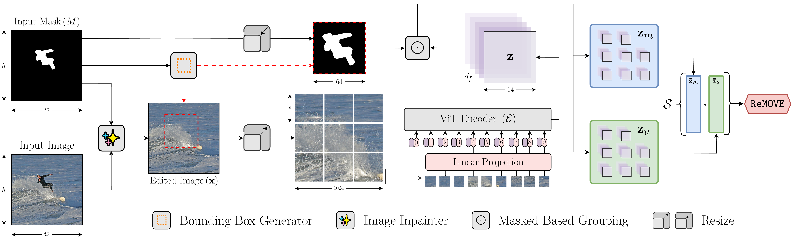
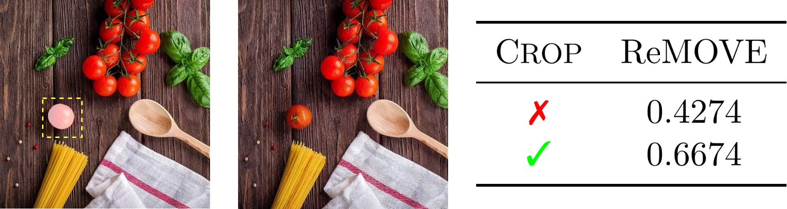
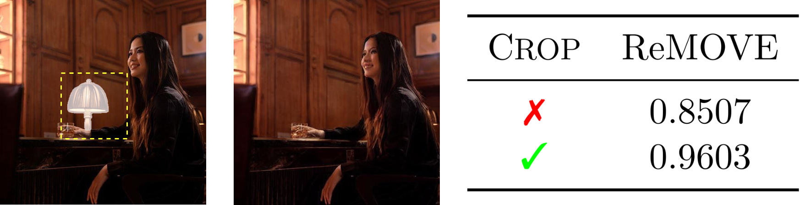

# ReMOVE

This is the official PyTorch implementation for the CVPRW 24 paper: "ReMOVE: A Reference-free Metric for Object Erasure".



## Requirements

This code was tested with `python=3.8.18`, `pytorch=2.0.1` and `torchvision=0.8.2`. Please follow the instructions [here](https://pytorch.org/get-started/locally/) to install PyTorch and TorchVision dependencies. Installing both PyTorch and TorchVision with CUDA support is strongly recommended.

**NOTE**: This codebase requires SAM to be installed. To install SAM, please follow the instructions [here](https://github.com/facebookresearch/segment-anything/blob/main/README.md#installation).

```
pip install git+https://github.com/facebookresearch/segment-anything.git
```

## Getting Started

### Setup ###

Start by downloading the model at `models/url.txt` (~2.4GB). Currently, `main.py` uses the ViT-H model, but other [models](https://github.com/facebookresearch/segment-anything/blob/main/README.md#model-checkpoints) can be used by modifying `L49` of `main.py`.

```
wget -i models/url.txt -P models/
```

### Usage ###

The `main.py` script takes the following arguments
* `--image_path` : Path to the image.
* `--mask_path` : Path to the corresponding mask.
* `--crop` (_optional_) : Crops the image using a bounding box around the object mask.
* `--draw` (_optional_) : Draws a bounding box around the object (saved to `masked.png`) if `--crop` is used.

A set of sample images with objects removed using various methods are provided in `./examples/`.

#### Bad Inpainting



```
python main.py -i 'examples/sdinpaint/823000000001.jpg' -m 'examples/masks/823000000001.jpg'
```

```
python main.py -i 'examples/sdinpaint/823000000001.jpg' -m 'examples/masks/823000000001.jpg' --crop
```

#### Good Inpainting



```
python main.py -i 'examples/sdinpaint/122000000009.jpg' -m 'examples/masks/122000000009.jpg'
```

```
python main.py -i 'examples/sdinpaint/122000000009.jpg' -m 'examples/masks/122000000009.jpg' --crop
```

## Citation

If you use ReMOVE or find this work useful for your research, please use the following BibTeX entry.
```bibtex
@InProceedings{Chandrasekar_2024_CVPRW,
    author    = {Chandrasekar$^*$, Aditya and Chakrabarty$^*$, Goirik and Bardhan, Jai and Hebbalaguppe, Ramya and AP, Prathosh},
    title     = {ReMOVE: A Reference-free Metric for Object Erasure},
    booktitle = {IEEE/CVF Conference on Computer Vision and Pattern Recognition Workshops (CVPRW)},
    year      = {2024},
}
```
